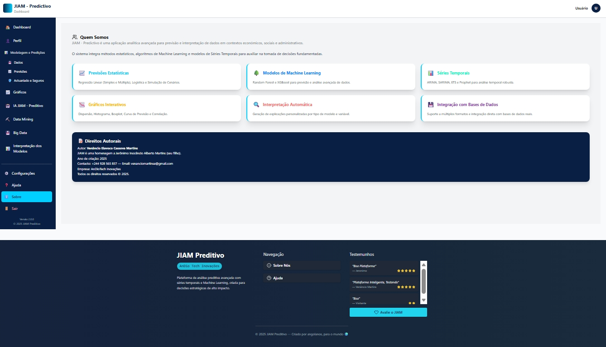
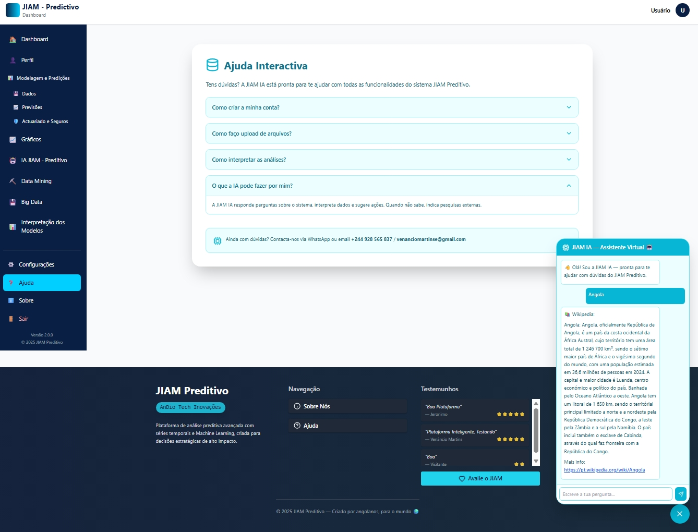

# JIAM Preditivo - Plataforma de Análise Preditiva com IA

**Autor:** Venâncio Elavoco Cassova Martins  
**ORCID:** [0009-0006-5893-7738](https://orcid.org/0009-0006-5893-7738)  
**Status:** Pronto para Produção | **Versão:** 2.0.0 | **Licença:** MIT


## Visão Geral

JIAM Preditivo é uma plataforma empresarial de análise preditiva que combina algoritmos avançados de machine learning com modelagem estatística em R para fornecer previsões precisas, insights inteligentes e recomendações acionáveis através de um dashboard intuitivo baseado em React.

## Funcionalidades Principais

- **Previsão Avançada de Séries Temporais** (ARIMA, SARIMA, ETS, Prophet)
- **Modelos de Machine Learning** (Random Forest, XGBoost, Regressão Linear/Logística)
- **Modelos Atuariais e Estatísticos** (GLM, Análise A Priori)
- **Dashboard Interativo** com visualização em tempo real
- **Relatórios PDF Profissionais** com insights de IA
- **Integração com R** para computação estatística
- **Segurança Empresarial** com autenticação JWT
- **Arquitetura Escalável** com design de microsserviços

## Início Rápido

### Pré-requisitos

- **Node.js** 18.0.0 ou superior
- **R** 4.0.0 ou superior (com pacotes necessários)
- **MongoDB** 7.0.0 ou superior
- **npm** ou **yarn** como gerenciador de pacotes
- **RStudio** ou ambiente R (opcional, para scripts R)

## Screenshots / GIFs

  
  


### Instalação

```bash
# Clonar o repositório
git clone https://github.com/bzamtwhmspm3pn3/JiamPreditivo
cd jiam-preditivo

# Instalar dependências do backend
cd backend
npm install

# Instalar dependências do frontend
cd ../frontend
npm install

# Configurar variáveis de ambiente
cp .env.example .env
```

### Configuração

**Configuração do Backend (backend/.env):**
```env
PORT=5000
NODE_ENV=development
MONGO_URI=mongodb://localhost:27017/jiam_preditivo
JWT_SECRET=sua_chave_secreta_jwt
JWT_EXPIRE=7d
JWT_REFRESH_SECRET=sua_chave_refresh
JWT_REFRESH_EXPIRE=30d
EMAIL_HOST=smtp.gmail.com
EMAIL_PORT=587
EMAIL_USER=seu_email@gmail.com
EMAIL_PASS=sua_senha_especifica
EMAIL_FROM=noreply@jiampreditivo.com
RATE_LIMIT_WINDOW=15
RATE_LIMIT_MAX=200
USE_R_PLUMBER=false
R_API_URL=http://localhost:8000
R_SCRIPT_PATH=./r-engine
LOG_LEVEL=info
```

**Configuração do Frontend (frontend/.env):**
```env
REACT_APP_API_URL=http://localhost:5000/api
REACT_APP_VERSION=2.0.0
REACT_APP_ENVIRONMENT=development
```

### Executando a Aplicação

```bash
# Iniciar Servidor Backend
cd backend
npm start
# Servidor executa em http://localhost:5000

# Iniciar Aplicação Frontend
cd ../frontend
npm start
# Frontend executa em http://localhost:3000

# Iniciar Servidor R API (opcional)
cd backend/r-engine
Rscript -e "plumber::plumb('api.R')$run(port=8000)"
```

## Arquitetura do Projeto

```
jiam-preditivo/
├── backend/                    # API Server Node.js + Express
│   ├── api/                    # Controladores da API
│   ├── controllers/            # Lógica de Negócio
│   ├── middleware/             # Middleware Express
│   ├── models/                 # Modelos MongoDB
│   ├── r-engine/               # Motor Estatístico R
│   ├── routes/                 # Rotas da API
│   ├── scripts/                # Scripts de Utilidade
│   ├── services/               # Serviços de Negócio
│   └── utils/                  # Funções Auxiliares
├── frontend/                   # Aplicação React
│   ├── public/                 # Arquivos Estáticos
│   ├── src/
│   │   ├── components/         # Componentes React
│   │   ├── contexts/           # Contextos React
│   │   ├── pages/              # Páginas da Aplicação
│   │   ├── services/           # Serviços da API
│   │   └── utils/              # Funções Utilitárias
├── docs/                       # Documentação
├── scripts/                    # Scripts de Implantação
├── tests/                      # Suítes de Teste
├── .env.example               # Modelo de Ambiente
├── docker-compose.yml         # Configuração Docker
├── LICENSE                    # Licença MIT
└── README.md                  # Este Arquivo
```

## Stack Tecnológico

- **Frontend**: React 18 + TypeScript
- **Backend**: Node.js + Express
- **Banco de Dados**: MongoDB
- **Motor Estatístico**: R 4.0+
- **Autenticação**: JWT + bcrypt
- **Visualização**: Recharts + D3.js
- **Geração de PDF**: jsPDF + autoTable
- **Containerização**: Docker
- **Testes**: Jest + React Testing Library

## Documentação da API

### URL Base
```
http://localhost:5000/api
```

### Endpoints de Autenticação
- `POST /auth/register` - Registro de Usuário
- `POST /auth/login` - Login de Usuário
- `POST /auth/refresh` - Atualizar Token
- `GET /auth/profile` - Obter Perfil do Usuário

### Endpoints de Modelos
- `POST /models/linear` - Regressão Linear
- `POST /models/logistic` - Regressão Logística
- `POST /models/random-forest` - Random Forest
- `POST /models/xgboost` - Modelo XGBoost
- `POST /models/arima` - Série Temporal ARIMA
- `POST /models/prophet` - Previsão Prophet
- `POST /models/actuarial` - Modelos Atuariais

### Gerenciamento de Dados
- `POST /data/upload` - Upload de Conjunto de Dados
- `GET /data/datasets` - Listar Conjuntos de Dados
- `GET /data/:id` - Obter Conjunto de Dados
- `DELETE /data/:id` - Excluir Conjunto de Dados

## Capacidades dos Modelos

### 1. Análise de Séries Temporais
- **ARIMA/SARIMA**: Média móvel integrada auto-regressiva
- **ETS**: Suavização exponencial de espaço de estado
- **Prophet**: Procedimento de previsão do Facebook
- **Multi-sazonal**: Lida com padrões sazonais complexos

### 2. Machine Learning
- **Random Forest**: Aprendizado em conjunto para classificação/regressão
- **XGBoost**: Gradient boosting com otimização
- **Regressão Linear**: Regressão simples e múltipla
- **Regressão Logística**: Classificação binária e multiclasse

### 3. Modelagem Estatística
- **Modelos Lineares Generalizados (GLM)**: Modelos de regressão flexíveis
- **Análise A Priori**: Inferência estatística
- **Teste de Hipóteses**: Intervalos de confiança, valores-p
- **Diagnóstico de Modelos**: Análise de resíduos, qualidade do ajuste

## Desenvolvimento

### Configurando Ambiente de Desenvolvimento

```bash
# Clonar o repositório
git clone https://github.com/bzamtwhmspm3pn3/JiamPreditivo
cd jiam-preditivo

# Instalar todas as dependências
npm run setup:all

# Iniciar servidores de desenvolvimento
npm run dev
```

### Scripts Disponíveis

```bash
# Comandos Backend
npm run start:backend     # Iniciar servidor backend
npm run dev:backend       # Iniciar com nodemon
npm run test:backend      # Executar testes backend

# Comandos Frontend
npm run start:frontend    # Iniciar aplicação React
npm run build:frontend    # Build para produção
npm run test:frontend     # Executar testes frontend

# Aplicação Completa
npm run dev              # Iniciar todos os serviços
npm run test            # Executar todos os testes
npm run build           # Build para produção
```

## Implantação

### Build de Produção

```bash
# Build de frontend e backend
npm run build:all

# Iniciar servidor de produção
npm start
```

### Implantação com Docker

```yaml
# docker-compose.yml
version: '3.8'
services:
  mongodb:
    image: mongo:7.0
    ports:
      - "27017:27017"
    volumes:
      - mongodb_data:/data/db

  backend:
    build: ./backend
    ports:
      - "5000:5000"
    environment:
      - NODE_ENV=production
      - MONGO_URI=mongodb://mongodb:27017/jiam_preditivo
    depends_on:
      - mongodb

  frontend:
    build: ./frontend
    ports:
      - "3000:80"
    depends_on:
      - backend

volumes:
  mongodb_data:
```

## Contribuição

Aceitamos contribuições! Por favor, siga estes passos:

1. **Fork do Repositório**
2. **Criar um Branch de Funcionalidade**
   ```bash
   git checkout -b feature/nova-funcionalidade
   ```
3. **Commit das Alterações**
   ```bash
   git commit -m 'Adicionar nova funcionalidade'
   ```
4. **Push para o Branch**
   ```bash
   git push origin feature/nova-funcionalidade
   ```
5. **Abrir um Pull Request**

### Diretrizes de Desenvolvimento
- Siga o estilo de código existente
- Escreva testes unitários para novas funcionalidades
- Atualize a documentação conforme necessário
- Garanta compatibilidade com versões anteriores

## Licença

Este projeto está licenciado sob a Licença MIT - veja o arquivo LICENSE para detalhes.

## Suporte & Contato

Para suporte, dúvidas ou contribuições:
- **Issues no GitHub**: Crie uma issue
- **Email**: venaciomartinse@gmail.com
- **Documentação**: Leia a documentação

## Roadmap Futuro
- Previsões em tempo real com streaming
- Capacidades de AutoML
- Aplicativo móvel
- Modelos ML adicionais (Redes Neurais, SVM)
- Suporte multilíngue
- Marketplace de API
- Recursos avançados de colaboração

*Última Atualização: Dezembro 2025 | Versão 2.0.0*